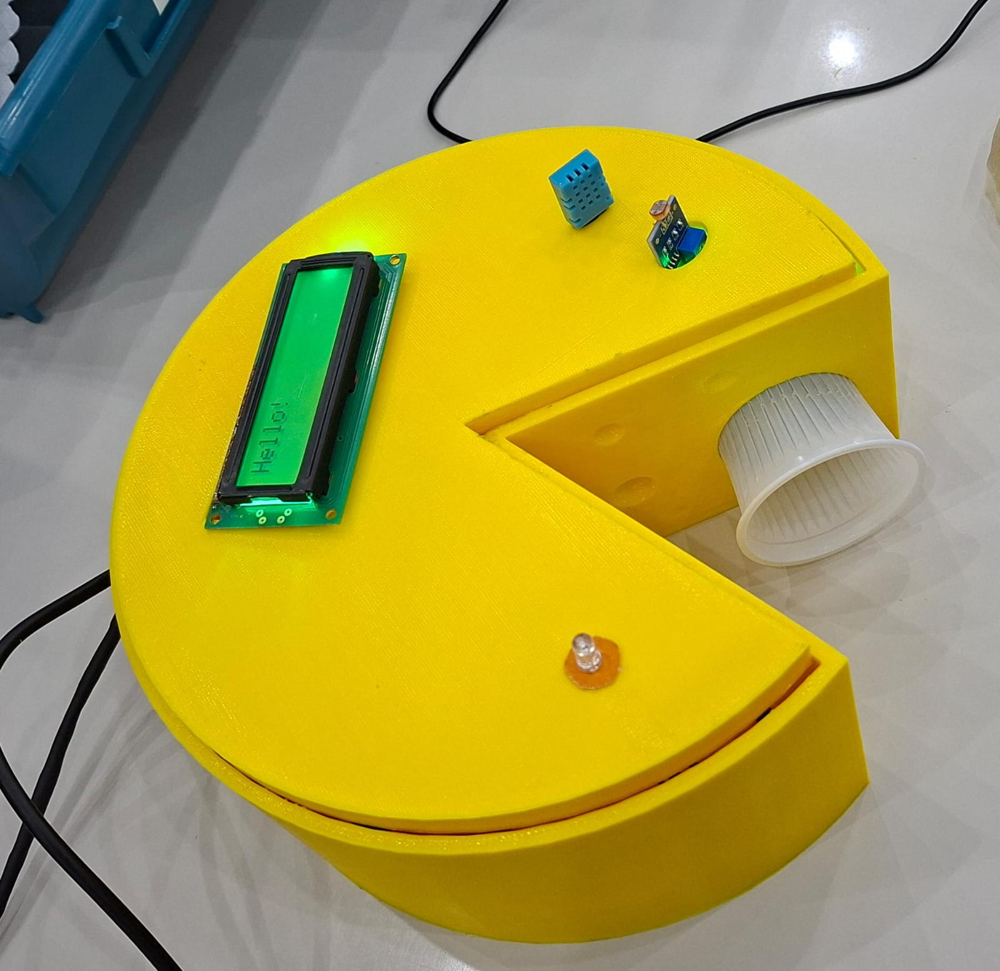

🧀 Smart Cheese Maturation Monitoring System

  

  IoT-based monitoring solution for cheese maturation chambers using ESP32, FIWARE, and real-time environmental supervision.

  
  
  
  
  
  

---

📖 About The Project

Cheese maturation is one of the most critical stages in the production of artisanal cheeses. During this process, environmental conditions such as temperature and humidity must remain within specific ranges to ensure the desired flavor, texture, consistency, and appearance of the final product.

This project presents an IoT-based monitoring system designed to supervise cheese maturation chambers in real time.

Using an ESP32 microcontroller connected to environmental sensors, the system continuously collects data and sends it to the FIWARE platform, where measurements can be visualized through a web application. Whenever abnormal conditions are detected, the system automatically generates alerts and activates local warning devices.

To reinforce the project's identity and demonstrate practical prototyping skills, a custom cheese-shaped enclosure was designed in AutoCAD and manufactured using 3D printing technology.

---

🎯 Project Motivation

Small-scale cheese producers often rely on manual inspections to monitor maturation conditions.

This project proposes a low-cost and scalable IoT solution capable of:

- Reducing manual supervision
- Improving environmental control
- Detecting abnormal conditions in real time
- Supporting product quality consistency
- Demonstrating the application of Industry 4.0 concepts in food production

---

🌳 Sustainable Development Goals

SDG 12 focuses on ensuring sustainable production and consumption patterns. Our project falls under two main pillars of this goal:

 - *Reducing Food Waste (Target 12.3)*

The maturation of cheeses (especially artisanal varieties such as Canastra, Parmesan, and Brie) requires rigorous temperature and humidity control. Abrupt variations favor the growth of unwanted fungi, excessive drying, or inadequate fermentation, resulting in the loss and disposal of entire batches.

Our monitoring system can track these environmental conditions, while an automated control system can directly prevent food loss throughout the production chain.

 - *Energy and Resource Efficiency (Target 12.2)*

By implementing intelligent control strategies (such as hysteresis or PID control), climate-control equipment (refrigeration and humidification systems), potentially used as actuators in the system, will only be activated when strictly necessary.

This approach prevents the continuous operation of compressors and heating elements, optimizing electricity consumption and improving resource efficiency within the maturation chamber.

---

✨ Features

- 🌡️ Temperature monitoring
- 💧 Humidity monitoring
- ☀️ Luminosity monitoring
- 📈 Historical data visualization
- 🌐 FIWARE integration
- 🔔 Automatic alert generation
- 💡 Visual warning system using LED
- 🔊 Audible warning system using a real voice
- ⚡ Real-time monitoring dashboard
- 📱 Remote supervision through web interface

---

📸 Project Demonstration

Monitoring Application

  

The web application displays environmental measurements in real time and provides historical visualization of collected data.

---

Physical Prototype

  

Custom enclosure developed specifically for the project.

The structure was modeled in AutoCAD and produced through 3D printing, creating a cheese-shaped housing that visually represents the system's application in cheese maturation chambers.

---

🎥 Demonstration Video

Watch the complete demonstration of the project:

"Video Demonstration" (https://youtu.be/your-video-link)

---

🏗️ System Architecture

+----------------------+
|      DHT11 Sensor    |
| Temperature/Humidity |
+----------+-----------+
           |
           |
+----------v-----------+
|        ESP32         |
+----------+-----------+
           |
           |
           v
+----------------------+
|      FIWARE API      |
|   Context Broker     |
+----------+-----------+
           |
           |
           v
+----------------------+
| Monitoring Interface |
| Historical Database  |
| Alert Management     |
+----------+-----------+
           |
           |
           v
+----------------------+
| LED + Voice Alerts  |
+----------------------+

---

🔧 Hardware Components

Component| Function
ESP32| Main microcontroller
DHT11| Temperature and humidity measurement
LDR| Luminosity measurement
LCD Display| Local data visualization
LED| Visual alert indication
Buzzer| Audible alert indication
3D Printed Enclosure| Protective and thematic housing

---

📊 Monitored Variables

Variable| Importance During Cheese Maturation
Temperature| Controls maturation speed and biochemical reactions
Humidity| Influences moisture loss, texture, and rind formation
Luminosity| Helps monitor environmental stability

---

🚨 Alert System

The system continuously evaluates sensor measurements against predefined thresholds.

When abnormal conditions are detected:

1. An alert is generated in the monitoring application.
2. A command is sent to the ESP32 through the FIWARE platform.
3. The warning LED is activated.
4. The buzzer emits an audible signal.
5. Alerts remain active until environmental conditions return to acceptable levels.

This mechanism allows rapid response to environmental deviations that could compromise the maturation process.

---

🚀 Technologies Used

Hardware

- ESP32
- DHT11 Sensor
- LDR Sensor
- LCD Display
- LED
- Buzzer

Software

- Arduino IDE
- C/C++
- HTML
- CSS
- JavaScript
- FIWARE
- REST API
- HTTP Communication

Design & Prototyping

- AutoCAD
- 3D Printing

---

📂 Project Structure

.
├── firmware/
│   ├── esp32_firmware.ino
│
├── web-app/
│   ├── css/
│   ├── js/
│   ├── index.html
│
├── assets/
│   ├── dashboard.png
│   ├── cheese-prototype.jpg
│   └── banner.png
│
└── README.md

---

⚙️ Installation

Clone the Repository

git clone https://github.com/your-username/smart-cheese-monitor.git

Configure the ESP32

Configure:

- Wi-Fi credentials
- FIWARE endpoint
- Device identifiers
- Alert thresholds

Upload the Firmware

Open the firmware project using Arduino IDE and upload it to the ESP32.

Start the Monitoring Application

Launch the web application and configure the FIWARE connection parameters.

---

📈 Results

The developed system successfully:

- Monitored environmental variables in real time
- Stored historical measurements
- Generated automatic alerts
- Activated local warning devices
- Provided remote supervision capabilities
- Demonstrated the viability of IoT solutions in food production environments

---

👨‍💻 Authors

- Daniel Cataneo
- Felipe Nascimento Silva
- Felipe Stefanes Dessico
- Gabriel Santos Galvão
- Oliver Carraro

---

📄 License

This project was developed for educational and academic purposes.

Feel free to use it as a reference for learning, research, and non-commercial projects.
